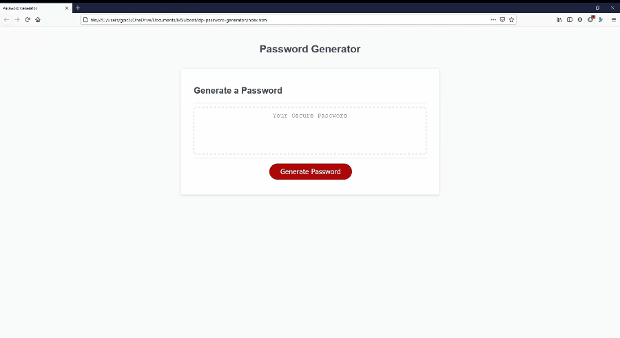

# Password Generator
This site was developed with the intention of creating a responsive application that will generate a password based on criteria selected by the user, while also being adaptable to multiple screen sizes. 
## Motivation
The motivation behind this project was to create an application that could provide password security, with multiple password criteria for the user to utilize, such as special characters, numbers, and lowercase/uppercase letters. 
## Tech/Framework Used
Built with Visual Code Studio
## Code Example
Here is an example of how the password generator works:

## Features
* Responsive user interface
* HTML and CSS powered by Javascript
* Adaptive screen sizing
* Prompts for user-selected criteria

## Installation
Clone this repository to your machine or download zip file.

## Usage
After the repository has been cloned, click on the index.html and open in browser. 
## License 
> You can reference the full license [here](https://github.com/Picke1id/idp_horiseon_code_refactor/blob/master/License).

This project is licensed under the terms of the MIT license.
